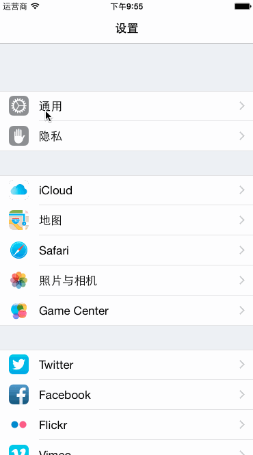

# FoodPin

用Swift写的一个简单的App。案例来自Beginning iOS 8 Programming with Swift一书。

[Beginning iOS 8 Programming with Swift 读书笔记](https://github.com/sxyx2008/DevArticles/issues/26)

# Screenshots

* 中文版

* 英文版

# 与我联系

* QQ:*184675420*

* Email:*sxyx2008#gmail.com*(#替换为@)

* HomePage:*[aimeizi.net](http://aimeizi.net)*

* Weibo:*[http://weibo.com/qq184675420](http://weibo.com/qq184675420)*(荧星诉语)

* Twitter:*[https://twitter.com/sxyx2008](https://twitter.com/sxyx2008)*

# License

MIT

Copyright (c) 2014 雪山飞鹄
