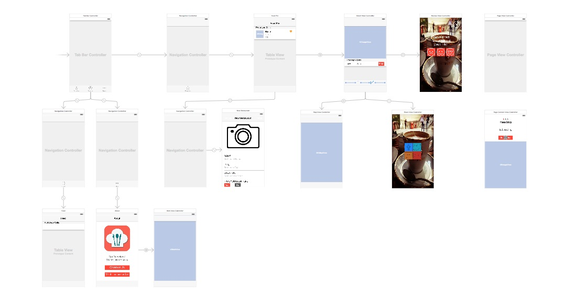

# FoodPin

用Swift写的一个简单的App。案例来自Beginning iOS 8 Programming with Swift一书。内容涉及AutoLayout、Core Animation、Core Data、国际化及ios8的一些新特性。

[Beginning iOS 8 Programming with Swift 读书笔记](https://github.com/sxyx2008/DevArticles/issues/26)

# Screenshots

* storyboard

* 中文版

* 英文版

# License

MIT

Copyright (c) 2014 雪山飞鹄
